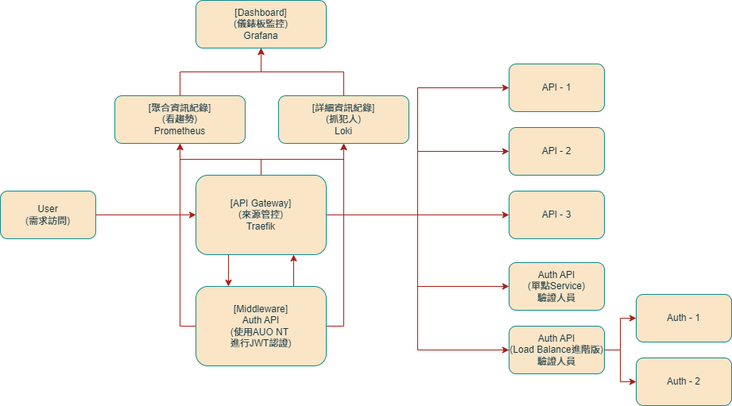

# API Gateway 設計說明

### 目標

* 保護內部 / 對外 API，不被濫用或打爆
* 支援 **人員登入（帳密 / JWT）** 與 **系統呼叫（API Key）**
* 可限制即時流量（rate limit）
* 可統計週期用量（週 / 月）
* 超過用量可自動或手動暫停使用者
* 全部使用 **Open Source Software，不花授權費**

### 架構圖

### 重要元件說明

 * Traefik（API Gateway）- 管理流量
 * Auth Server（自行開發）- 管理身分與狀態
 * Prometheus - 收集 API 使用狀況
 * Loki - 收集 API 事件（Log）
 * Grafana - 查詢 / Dashboard / Alert
  
[元件詳細技術介紹](技術介紹.md)